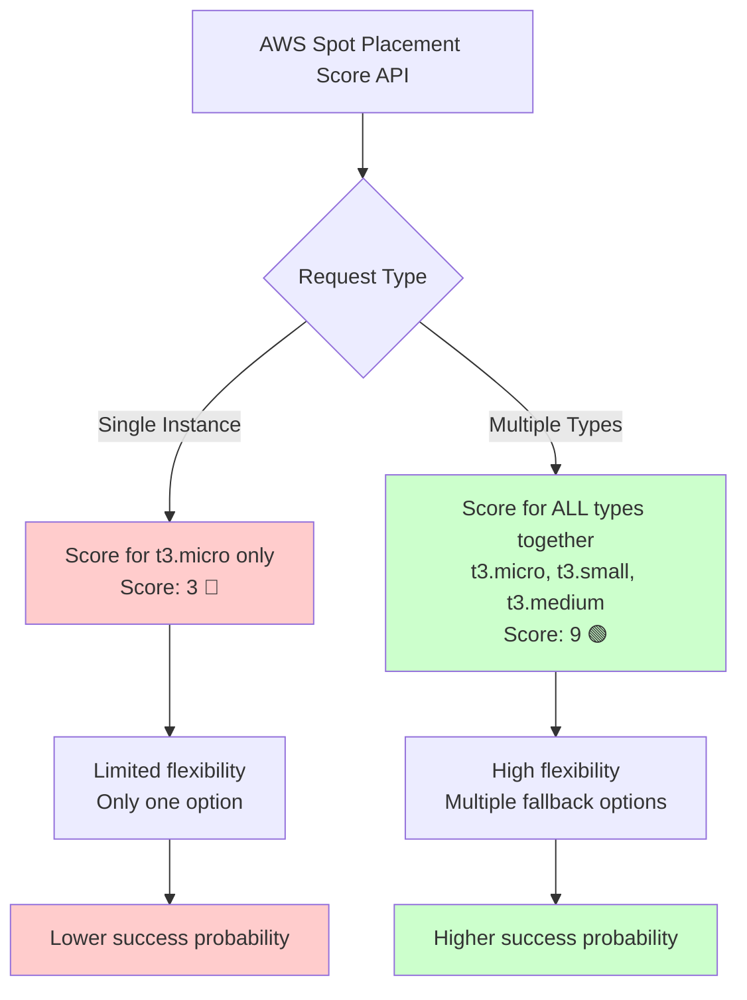

# AWS Spot Placement Scores

## Overview

AWS Spot Placement Scores provide insights into the likelihood of successfully launching Spot instances in different regions and availability zones. This feature helps DevOps engineers make data-driven decisions when selecting spot instances for cost optimization.

## What are Spot Placement Scores?

Spot Placement Scores are **1-10 ratings** provided by AWS that indicate:
- **10**: Very high likelihood of successful spot instance launch
- **1**: Very low likelihood of successful spot instance launch

The scores are calculated by AWS based on:
- Current spot capacity availability
- Historical demand patterns
- Instance type popularity
- Regional capacity distribution

## Critical Understanding: Contextual Scoring

**🚨 Important**: Spot Placement Scores are **contextual** - they represent the likelihood of fulfilling your **entire request**, not individual instance types.



### Why Scores Differ by Query Context

| Query Type | What AWS Evaluates | Example Score |
|------------|-------------------|---------------|
| `--type "t3.micro"` | Can I fulfill **only** t3.micro? | 3 🔴 (Limited options) |
| `--type "t3.*"` | Can I fulfill **any** t3 instance type? | 9 🟢 (Flexible options) |

This is **expected behavior** - providing multiple instance types gives AWS more flexibility to fulfill your request.

## Visual Score Indicators

`spotinfo` provides intuitive visual indicators for quick assessment:

| Score Range | Indicator | Meaning | Recommendation |
|-------------|-----------|---------|----------------|
| 8-10 | 🟢 | Excellent | Highly recommended |
| 5-7 | 🟡 | Moderate | Consider alternatives |
| 1-4 | 🔴 | Poor | High risk of interruption |
| Unknown | ❓ | No data | Proceed with caution |

## Regional vs Availability Zone Scores

### Regional Scores
- Evaluate placement likelihood across **entire regions**
- Best for general capacity planning
- Header: "Placement Score (Regional)"

### AZ-Level Scores  
- Evaluate placement likelihood for **specific availability zones**
- Best for precise deployment targeting
- Header: "Placement Score (AZ)"
- Format: `us-east-1a:🟢 9`

## Usage Examples

### Basic Score Queries

```bash
# Get regional placement scores
spotinfo --type "m5.large" --with-score --region "us-east-1"

# Get AZ-level placement scores  
spotinfo --type "m5.large" --with-score --az --region "us-east-1"
```

### Filtering by Score Thresholds

```bash
# Find instances with excellent placement scores (8+)
spotinfo --type "t3.*" --with-score --min-score 8

# High-reliability instances for production
spotinfo --type "m5.*" --with-score --min-score 7 --sort score --order desc
```

### Strategic Instance Selection

```bash
# Single instance assessment (precise evaluation)
spotinfo --type "c5.xlarge" --with-score --region "us-east-1"

# Flexible deployment options (higher scores expected)
spotinfo --type "c5\.(large|xlarge|2xlarge)" --with-score --region "us-east-1"
```

## Output Formats

### Visual Formats (with emojis)
- **Table**: `🟢 9` (includes visual indicators)
- **Text**: `score=us-east-1a:🟢 9`

### Data-Only Formats (automation-friendly)
- **CSV**: `us-east-1a:9` (no emojis)
- **JSON**: `{"region_score": 9, "score_fetched_at": "2025-01-26T..."}`

## Score Freshness Tracking

Placement scores include timestamp tracking for cache freshness:

```json
{
  "region_score": 9,
  "score_fetched_at": "2025-01-26T10:45:02.844335+03:00"
}
```

Stale scores (>30 minutes) are indicated with an asterisk: `🟢 9*`

## Command Reference

| Flag | Description | Example |
|------|-------------|---------|
| `--with-score` | Enable placement score fetching | `--with-score` |
| `--az` | Get AZ-level scores instead of regional | `--with-score --az` |
| `--min-score N` | Filter instances with score ≥ N | `--min-score 7` |
| `--sort score` | Sort results by placement score | `--sort score --order desc` |
| `--score-timeout N` | Set API timeout in seconds | `--score-timeout 30` |

## DevOps Best Practices

### For Production Workloads
```bash
# High-reliability instances with flexibility
spotinfo --type "m5\.(large|xlarge|2xlarge)" --with-score --min-score 7 --region "us-east-1"
```

### For Cost-Optimized Development
```bash
# Find cheapest instances with acceptable reliability
spotinfo --type "t3.*" --with-score --min-score 5 --sort price --order asc
```

### For Multi-Region Deployment
```bash
# Compare placement scores across regions
spotinfo --type "c5.large" --with-score --region "us-east-1" --region "eu-west-1"
```

## Permissions Requirements

### IAM Policy
```json
{
  "Version": "2012-10-17",
  "Statement": [
    {
      "Effect": "Allow",
      "Action": "ec2:GetSpotPlacementScores",
      "Resource": "*"
    }
  ]
}
```

### AWS Organizations (SCP)
Ensure no Service Control Policy blocks `ec2:GetSpotPlacementScores`. SCPs override IAM permissions.

## Troubleshooting

### Common Issues

**Different scores for same instance type:**
- ✅ **Expected behavior** - scores are contextual to the entire request
- Single vs multiple instance queries will yield different scores

**Permission errors:**
- Check IAM policy includes `ec2:GetSpotPlacementScores`
- Verify no SCP blocks the action (common in AWS Organizations)

**API timeouts:**
- Increase timeout: `--score-timeout 60`
- The tool falls back to embedded data if API unavailable

### Fallback Behavior

If AWS API is unavailable, `spotinfo` uses deterministic mock scores for demonstration purposes. Real deployments should use actual AWS placement scores.

## Data Sources

Placement scores are fetched from:
- **Primary**: AWS `GetSpotPlacementScores` API
- **Fallback**: Deterministic mock provider (for offline functionality)

See [Data Sources](data-sources.md) for complete information.