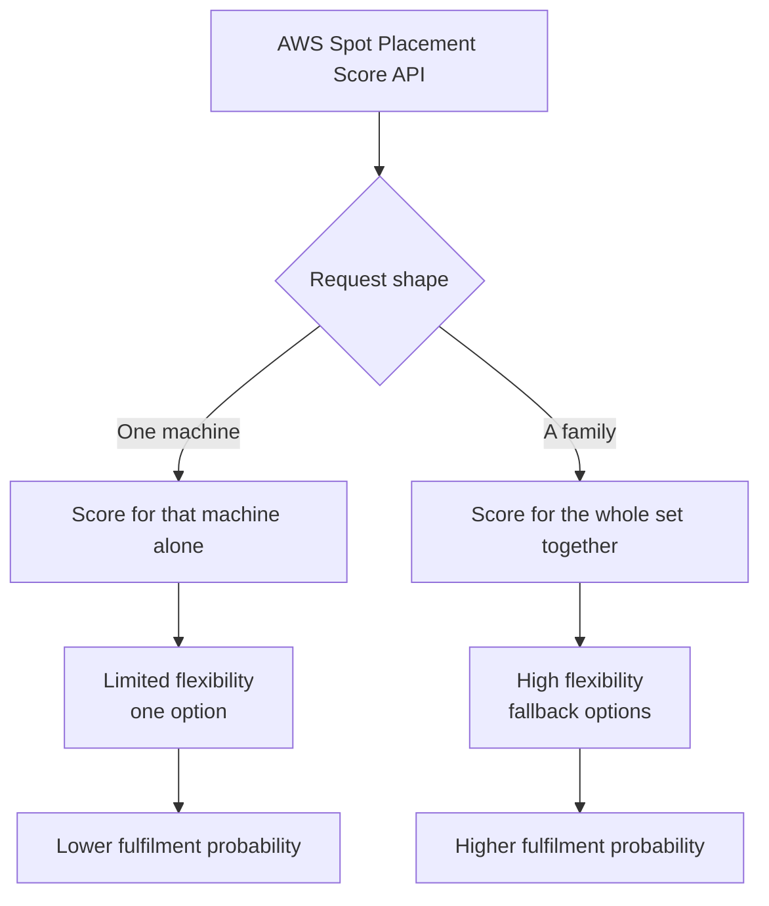

# Placement figures

`--with-score` asks a cloud how likely it is to *fulfil* a Spot request. That is a different
question from "how likely is it to be interrupted", which is what the `RISK` column answers,
and the two are never combined.

Two clouds publish a placement figure, and they publish different measurements:

| Cloud   | Figure                | Scale                    | Where                       | Interface                                       |
| ------- | --------------------- | ------------------------ | --------------------------- | ----------------------------------------------- |
| `aws`   | Spot placement score  | integer **1-10**         | `list` and `recommend`      | `ec2:GetSpotPlacementScores`, GA                |
| `gcp`   | Obtainability         | probability **0.0-1.0**  | `recommend` only            | `compute.advice.capacity`, **beta**             |
| `azure` | none                  | —                        | —                           | published, but needs a subscription — not built |

**They are never normalised onto a shared scale.** No vendor published a mapping between an
AWS 1-10 score and a Google probability, so spotinfo does not invent one. Each figure carries
its kind, and the column header follows the kind — `Placement Score (Regional)` against
`Obtainability (Regional)` — because a reader who saw "Placement Score" over `0.83` would read
it as a very bad score.

The rest of this page is about the AWS score. For obtainability, see
[Cloud coverage](clouds.md#gcp) and [API reference](api-reference.md).

## What an AWS placement score is

An integer 1-10 from AWS:

- **10**: very high likelihood of a successful Spot launch
- **1**: very low likelihood

AWS calculates it from current Spot capacity, historical demand, instance-type popularity and
regional capacity distribution. It is a capacity signal, not a price and not an interruption
rate.

## Critical understanding: the score is contextual

**The score describes your entire request, not one machine.** Ask about one instance type and
AWS answers "can I fulfil only that"; ask about a family and it answers "can I fulfil any of
these". The second is a different, usually easier, question.


```mermaid
graph TD
    A[AWS Spot Placement Score API] --> B{Request shape}
    B -->|One machine| C[Score for that machine alone]
    B -->|A family| D[Score for the whole set together]

    C --> E[Limited flexibility<br/>one option]
    D --> F[High flexibility<br/>fallback options]

    E --> G[Lower fulfilment probability]
    F --> H[Higher fulfilment probability]
```

| Request                      | What AWS evaluates                        |
| ---------------------------- | ----------------------------------------- |
| `--machine '^t3\.micro$'`    | Can I fulfil **only** `t3.micro`?         |
| `--machine '^t3\.'`          | Can I fulfil **any** `t3` machine?        |

The same machine scoring differently in the two queries is **expected**, not a bug. Widening
the pattern gives AWS more ways to say yes.

## Visual score indicators

| Score range | Indicator | Meaning  |
| ----------- | --------- | -------- |
| 8-10        | 🟢        | Excellent |
| 5-7         | 🟡        | Moderate  |
| 1-4         | 🔴        | Poor      |
| Unknown     | ❓        | No data   |

The emoji appear in `table` and `text` output only. `csv` carries the number without them, and
`json` carries it as a plain integer, so a pipeline never has to strip an emoji.

## Regional versus zone scores

**Regional** scores evaluate a whole region and suit capacity planning. The column header is
`Placement Score (Regional)`.

**Zone** scores evaluate one availability zone and suit precise placement. Add `--az`. The
header becomes `Placement Score (AZ)` and each cell reads `us-east-1a:🟢 9`. A page carrying
both kinds falls back to the generic header `Placement Score`.

## Usage

The four score flags are declared on **both** `spotinfo list` and `spotinfo recommend`. There
is no root query command.

```bash
# Regional scores for one machine
spotinfo list --machine '^m5\.large$' --with-score --region us-east-1

# Zone-level scores for the same machine
spotinfo list --machine '^m5\.large$' --with-score --az --region us-east-1

# Only machines AWS scores 8 or better
spotinfo list --machine '^t3\.' --with-score --min-score 8 --region us-east-1

# Highest-scoring first
spotinfo list --machine '^m5\.' --with-score --min-score 7 --sort score --order desc --region us-east-1

# On a recommendation, the score annotates the ranked page
spotinfo recommend --architecture x86_64 --min-vcpu 2 --min-memory-gib 8 --with-score --region us-east-1
```

Every example above calls AWS. Each needs credentials and
`ec2:GetSpotPlacementScores`; without them the command fails rather than printing a number
nobody measured — see [Fallback behaviour](#fallback-behaviour).

### Flags

| Flag              | Meaning                                     | Default    |
| ----------------- | ------------------------------------------- | ---------- |
| `--with-score`    | fetch placement figures (experimental)      | off        |
| `--az`            | zone-level instead of regional              | off        |
| `--min-score N`   | keep only rows scoring at least N (1-10)    | no filter  |
| `--sort score`    | order by the placement figure               | no default |
| `--score-timeout` | seconds for placement enrichment, 1-300     | 30         |

`--min-score` is 1-10 on the CLI; the MCP `min_score` schema also accepts `0`, which is the
"no filter" sentinel and not a floor a real score could fail.

Three refusals worth knowing, each measured:

```console
$ spotinfo list --offline --sort score
spotinfo: invalid argument: --sort score needs --with-score, which is what fetches the placement figures it orders by

$ spotinfo list --cloud gcp --with-score --min-score 5
spotinfo: unsupported capability: --min-score is refused on gcp: gcp publishes obtainability, and an integer 1-10 floor states no reviewed mapping onto it

$ spotinfo list --cloud gcp --with-score
spotinfo: failed to get spot savings: unsupported capability: gcp obtainability is fetched for a ranked recommendation only, and needs a Google Cloud project
```

**`--offline` does not suppress `--with-score`.** The flag governs price and risk acquisition,
and there is no snapshot a placement figure can be read from, so the call still goes out:

```console
$ spotinfo list --offline --region us-east-1 --machine '^m5\.large$' --with-score --score-timeout 3
spotinfo: failed to get spot savings: aws candidate acquisition: score enrichment failed: region us-east-1: spot placement scores unavailable: requires AWS credentials and the ec2:GetSpotPlacementScores permission: …
```

## Output formats

| Format  | Score cell                                             |
| ------- | ------------------------------------------------------ |
| `table` | `🟢 9`, or `us-east-1a:🟡 7*` with `--az`              |
| `text`  | `score=🟢 8`, or `score=us-east-1a:🟡 7*,us-east-1b:🟢 9*` |
| `csv`   | `8`, or `us-east-1a:7*` — no emoji                     |
| `json`  | `"region_score": 8`, or `"zone_scores": {…}`, plus `"score_fetched_at"` |

## Score freshness

A fetched score carries the instant it was measured:

```json
{
  "region_score": 9,
  "score_fetched_at": "2026-08-06T08:58:27Z"
}
```

A score older than thirty minutes is marked with an asterisk in `table`, `text` and `csv`:
`🟢 9*`.

## Permissions

```json
{
  "Version": "2012-10-17",
  "Statement": [
    {
      "Effect": "Allow",
      "Action": "ec2:GetSpotPlacementScores",
      "Resource": "*"
    }
  ]
}
```

In an AWS Organization, check that no Service Control Policy blocks
`ec2:GetSpotPlacementScores`. An SCP overrides IAM.

## Troubleshooting

**The same machine scores differently in two queries.** Expected — the score describes the
whole request. See [contextual scoring](#critical-understanding-the-score-is-contextual).

**Permission errors.** Check the IAM policy above, then check for an SCP.

**Timeouts.** Raise `--score-timeout` (1-300 seconds, default 30). There is no fallback to
raise it *instead* of — see below.

### Fallback behaviour

**There is none, deliberately.** If the AWS API is unreachable or the permission is missing,
`spotinfo` reports an error instead of substituting a score. Placement scores drive capacity
decisions, and an invented number presented as an AWS score is worse than an explicit failure.
This is the one enrichment that does not degrade to the snapshot: there is nothing in the
snapshot to degrade to. Machines AWS declines to score are omitted from the answer rather than
defaulted to zero.

## Data sources

- **AWS**: `GetSpotPlacementScores`, live, no fallback.
- **GCP**: `compute.advice.capacity` (beta), live, needs Application Default Credentials and
  `--gcp-project`.

See [Data sources](data-sources.md) for the full treatment.
