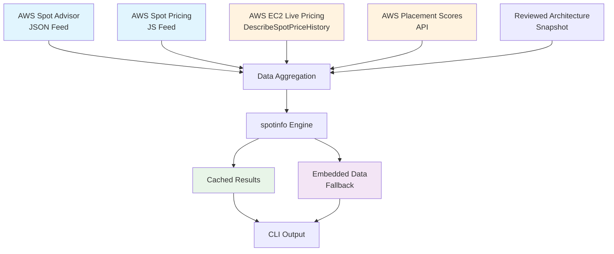

# Data Sources

## Overview

`spotinfo` combines multiple data sources to provide comprehensive AWS EC2 Spot Instance information, including pricing, interruption rates, and placement scores.

## GCP source instability, observed 2026-08-10

Two distinct defects were found in Google's pages on the same day. They need
different responses, and telling them apart matters.

**1. The Spot page serves two price generations at random.** Five consecutive
requests to `https://cloud.google.com/spot-vms/pricing`, same URL and same
User-Agent, alternated between price generations:

| request | sha256 (first 12) | `n2-standard-4` |
| ------- | ----------------- | --------------- |
| 1       | `f5b4730f89b6`    | $0.101336       |
| 2       | `29dde0bdbd27`    | $0.101336       |
| 3       | `a2045bde734f`    | $0.111472       |
| 4       | `ff9a30e23b20`    | $0.111472       |
| 5       | `593091bf36fc`    | $0.101336       |

A refresh during a rollout like this is a coin flip, and worse: the four
contracted pages are fetched seconds apart, so one run can mix generations
across pages and publish a Spot price from one against an On-Demand price from
another — a savings figure computed from two different days. Nothing downstream
can catch that: both numbers are well-formed, in range, and from the contracted
URL.

**The updater now reads every contracted page twice and refuses when the copies
differ**, reporting both hashes:

```
update-gcp-data: gcp pricing page is not serving a stable document:
https://cloud.google.com/spot-vms/pricing returned 8ab59daf3daf... then
5bd608f1d6c6.... The source is mid-rollout; a snapshot taken now can mix price
generations across pages. Retry when the hashes agree
```

That is a wait-and-retry condition, not a parser problem, and the updater says
so with its exit code: **75** (`EX_TEMPFAIL`) for an unstable source, 1 for
everything else. The weekly workflow branches on it and reports the run as a
notice rather than a failure, skipping the verify, test and pull-request steps.
Collapsing the two would turn this job red most weeks for a reason nobody must
act on, and the one week it goes red for a real reason is the week it is ignored.

Neither `go run` nor `make` preserves that code — the first collapses every
non-zero exit to 1, the second reports its own 2 — so the workflow builds the
binary and invokes it directly. Two identical reads do
not prove the source is stable; two different ones prove it is not, which is the
case worth refusing. The `general-purpose` page was stable across the same
window, so instability is per-page and every page is checked.

**A second gate brackets the whole read window.** Comparing a page against itself
cannot see a rollover that lands *between* two pages, and that is the one which
actually corrupts a snapshot: a Spot price from one generation over an On-Demand
price from the next. After the last page is read, the updater re-reads the first
one and refuses when its hash moved:

```text
update-gcp-data: gcp pricing page is not serving a stable document:
https://cloud.google.com/spot-vms/pricing hashed 8ab59daf3daf... before the other
pages were read and 5bd608f1d6c6... after. The source rolled over mid-run; a
snapshot taken now can pair prices from two generations. Retry when the hashes agree
```

One extra download per run covers every gap between the pages. Both gates are
kept — the per-page read catches a flip inside one page's window, the bracket
catches a flip between windows — and both report `ErrSourceUnstable`, so either
exits 75.

**Why the Azure updater does not do the same.** Azure's prices come from the
Retail Prices API, a versioned endpoint whose rows carry `effectiveStartDate`
and `effectiveEndDate`, and the parser already resolves all 55 regions against
one instant so a sweep cannot mix an expiring rate with its replacement. Its
Learn size pages supply vCPU, memory and architecture — values that change when
a size is introduced, not on a pricing rollout, and a page that came back short
trips the per-region coverage floor. Doubling 26 page fetches to guard a risk
that has not been observed there would be machinery without evidence. If an
Azure refresh ever produces a spec contradiction or an unexplained price jump,
this is the first thing to add.

**2. `c3d-standard-8` has a genuinely wrong memory cell.** The on-demand page
lists it as 8 vCPU / 16 GiB in every fetch, while `c3d-standard-4` is 16 GiB and
`c3d-standard-16` is 64 GiB, its own price is exactly twice `c3d-standard-4`'s,
and `compute.machineTypes.list` reports 32 GiB. One wrong cell, stably served.

This one used to abort the entire refresh, freezing all 333 machine prices over
a single bad row. `BuildCatalog` now excludes a machine whose two pages disagree
about its shape — the same treatment a machine with no On-Demand pair already
got — reports it on stderr, and leaves the coverage floor to decide whether what
survived is still worth committing. The parser was **not** widened and no
threshold was lowered: a contradictory machine is still never published.

The committed snapshot predates both defects, carries the correct 32 GiB for
`c3d-standard-8`, and is internally consistent. It is deliberately left in place.

## Primary Data Sources

### 1. AWS Spot Instance Advisor Data

- **Source**: [AWS Spot Advisor JSON feed](https://spot-bid-advisor.s3.amazonaws.com/spot-advisor-data.json)
- **Maintained by**: AWS team
- **Update frequency**: Irregular — AWS republishes it every few months, so expect the
  savings and interruption figures to lag the market. The weekly `update-data` workflow
  warns if this feed has not changed in 180 days.
- **Contains**:
  - Instance specifications (vCPU, memory, EMR compatibility)
  - Interruption frequency ranges
  - Savings percentages compared to on-demand pricing
  - Regional availability data

### 2. AWS Spot Pricing Data

- **Source**: [AWS spot pricing feed](https://website.spot.ec2.aws.a2z.com/spot.json) — the
  feed behind <https://aws.amazon.com/ec2/spot/pricing/>
- **Maintained by**: AWS team
- **Update frequency**: Hourly
- **Format**: Plain JSON (no JSONP `callback(...)` wrapper)
- **Contains**:
  - Current spot prices by region and instance type
  - Operating system pricing variations (Linux/Windows)
- **Coverage**: 40 regions. Note that AWS omits all Middle East (`me-*`) regions from this
  feed; instances there report `$0` and fall through to the live pricing API below.
- **Caveat**: This is an undocumented endpoint, not a published AWS API. It can change
  without notice, which is why every fetch falls back to the embedded copy on failure.

> **Superseded source.** `http://spot-price.s3.amazonaws.com/spot.js` was the original JSONP
> feed. It has been frozen since **2024-05-13** and is missing every instance family released
> after that date, so it is no longer used.
>
> Mind the extension: the same host as the live feed also serves
> `website.spot.ec2.aws.a2z.com/spot.**js**`, which is a byte-identical copy of that dead
> object (same ETag). Only `spot.**json**` is live.

### 3. AWS EC2 Live Spot Pricing API

- **Source**: AWS `DescribeSpotPriceHistory` API
- **Access**: Real-time API calls (requires `ec2:DescribeSpotPriceHistory` permission)
- **Purpose**: Fills in pricing for instance types missing from the static feed — the newest
  families in the days before AWS adds them, plus every instance in the Middle East (`me-*`)
  regions, which AWS omits from the static feed entirely
- **Trigger**: Only called when instances have advisor data but $0 pricing from the static feed
- **Contains**:
  - Current spot prices per instance type and region
  - Prices from the last hour of trading
- **Behavior**:
  - Fetches prices in parallel across regions
  - Batches requests (up to 50 instance types per call)
  - Gracefully degrades — if unavailable, prices remain $0
  - Results marked with `live_price: true` in output

### 4. Reviewed Instance-Family Architecture Snapshot

- **Source**: `internal/spot/data/architecture-snapshot.json`, manually reviewed against AWS EC2 instance type processor architecture documentation
- **Purpose**: Classifies Advisor instance families as `x86_64` or `arm64` for `spotinfo recommend`; it does not select an OS price stream
- **Reviewed exceptions**: G6, G6e, G6f, and Hpc8a are AMD EPYC (`x86_64`), despite nearby family naming patterns that could be misleading. Arm families are listed explicitly too.
- **Runtime behavior**: Embedded only; `recommend` never calls AWS metadata APIs to discover architecture. Its command-local `--os linux|windows` is passed only to the existing Spot price lookup.
- **Safety and freshness**: A family absent from the reviewed snapshot is not guessed and cannot become a recommendation. The snapshot is committed separately from the Advisor feed, so a newly published family may be omitted until a reviewed update is committed. `provenance` must be non-empty and `reviewed_at` must be a valid `YYYY-MM-DD` date; malformed snapshots are rejected. This manual review is the principal freshness limitation.

### 5. AWS Spot Placement Scores API

- **Source**: AWS `GetSpotPlacementScores` API
- **Access**: Real-time API calls (requires IAM permissions)
- **Contains**:
  - Regional placement scores (1-10 scale)
  - Availability zone-level placement scores
  - Likelihood of successful spot instance launch
  - Contextual scoring based on request composition

## Google Cloud Data Sources

### 6. GCP Public Pricing Pages

- **Sources** (all official, all server-rendered, all anonymous):
  - [Spot VM pricing](https://cloud.google.com/spot-vms/pricing) — Spot price, vCPU, memory
  - [General-purpose](https://cloud.google.com/products/compute/pricing/general-purpose),
    [compute-optimized](https://cloud.google.com/products/compute/pricing/compute-optimized) and
    [memory-optimized](https://cloud.google.com/products/compute/pricing/memory-optimized)
    machine-family pages — the `Default* (USD)` On-Demand column
  - [Machine resource documentation](https://docs.cloud.google.com/compute/docs/machine-resource) —
    processor architecture, reviewed by hand
- **Approved contract**: `internal/providers/gcp/data/source-contract.json`. No GCP page is read
  unless it is enumerated there. The reasoning is in
  [multicloud source contracts](research/multicloud-source-contracts.md).
- **Embedded snapshot**: `internal/providers/gcp/data/catalog.json.gz` plus its sidecar
  `manifest.json`. 333 machine types, both price classes, 5,815 compressed bytes.
- **Update frequency**: weekly, through the `update-gcp-data` workflow.
- **Region coverage**: `us-central1` only. The pages server-render one region and switch the
  rest in with JavaScript, which spotinfo does not execute. A request for any other region
  returns `NO_CANDIDATES`; no other region is ever substituted.
- **OS coverage**: Linux only.
- **Risk**: none. GCP publishes preemption history only through the authenticated
  `advice.capacityHistory` beta, so every GCP candidate reports
  `risk.status = "unavailable"` rather than a low number. Consequently GCP serves only the
  risk-free `cost` workload.
- **Runtime**: entirely offline. No credential, token, project, or network request.

### 7. Azure Retail Prices API and Microsoft Learn VM size pages

- **Prices**: `https://prices.azure.com/api/retail/prices`, the documented, anonymous Azure
  Retail Prices API. It is swept once per approved region with
  `serviceName eq 'Virtual Machines' and armRegionName eq '<region>' and priceType eq 'Consumption'`,
  following `NextPageLink` until the region is exhausted.
- **Specifications and architecture**: one Microsoft Learn size page per approved machine
  series, for example
  `https://learn.microsoft.com/en-us/azure/virtual-machines/sizes/general-purpose/dv5-series`.
  The Retail API publishes no vCPU count, memory figure, or processor architecture, so none of
  the three is inferred from a size name.
- **Approved contract**: `internal/providers/azure/data/source-contract.json`. All 27 source
  URLs are enumerated there; no other document is read.
- **Embedded snapshot**: `internal/providers/azure/data/catalog.json.gz` plus its sidecar
  `manifest.json`. 224 VM sizes across 26 series in 55 regions, 21,656 priced rows — 11,204
  Linux and 10,452 Windows — and 209,979 compressed bytes.
- **Update frequency**: weekly, through the `update-azure-data` workflow.
- **Region coverage**: 55 regions. This is the canonical list; every other document states the
  count and links here.

  `australiacentral`, `australiacentral2`, `australiaeast`, `australiasoutheast`, `austriaeast`,
  `belgiumcentral`, `brazilsouth`, `brazilsoutheast`, `canadacentral`, `canadaeast`,
  `centralindia`, `centralus`, `eastasia`, `eastus`, `eastus2`, `francecentral`, `francesouth`,
  `germanynorth`, `germanywestcentral`, `indonesiacentral`, `israelcentral`, `israelnorthwest`,
  `italynorth`, `japaneast`, `japanwest`, `koreacentral`, `koreasouth`, `mexicocentral`,
  `newzealandnorth`, `northcentralus`, `northeurope`, `norwayeast`, `norwaywest`, `polandcentral`,
  `qatarcentral`, `southafricanorth`, `southafricawest`, `southcentralus`, `southeastasia`,
  `southindia`, `spaincentral`, `swedencentral`, `swedensouth`, `switzerlandnorth`,
  `switzerlandwest`, `uaecentral`, `uaenorth`, `uksouth`, `ukwest`, `westcentralus`, `westeurope`,
  `westindia`, `westus`, `westus2`, `westus3`.

  The list is **derived, not chosen**: 67 regions publish Spot meters for the 26 contracted
  series, the join against the Learn size pages leaves 59 candidates, and 55 of those carry at
  least `min_machines`. The four that fall short are excluded rather than accommodated — the
  coverage floor is applied per region, so a healthy total cannot absorb a short one.
  An unset `--region`, or `--region all`, enumerates exactly this set. A request for any other
  region returns `NO_CANDIDATES`; no region is substituted.

- **OS coverage**: Linux and Windows. The operating system is read from the `productName`
  suffix — `" Windows"` for a licence-bundled meter, `" Linux"` on the families that spell it
  out, and no suffix for Linux on every older family — and each is a separate priced row, so a
  Windows Spot price is only ever a saving against the Windows list price. 196 of the 224 sizes
  carry a Windows meter; the rest are Arm sizes Azure does not license.
- **Risk**: none. Azure publishes eviction rates only through Resource Graph `SpotResources` and
  Resource SKUs, both of which require a subscription, so every Azure candidate reports
  `risk.status = "unavailable"` rather than a low number. Consequently Azure serves only the
  risk-free `cost` workload.
- **Runtime**: still credential-free — no token, subscription or tenant — but no longer
  request-free. A query naming **one or two** covered regions refreshes their prices from the
  same anonymous Retail Prices API before answering. Everything else answers from the committed
  snapshot: `--offline`, `--region all` (the default), an unset region, three or more regions,
  and a region the contract does not cover. See **Live Azure prices** below.

**Live Azure prices.**

A live sweep reads the exact contracted request above — same endpoint, same OData filter, same
parser — so it can refresh approved coverage and cannot widen it. Measured against the live API
on 2026-08-11, one region (`westeurope`) is **9,022 meters over 10 pages and 5.5 MB, in 6.9
seconds**. That cost is what bounds the feature:

- **Two regions at most.** The whole enrichment gets a 20-second budget, the same one the GCP
  live-risk path spends on an optional extra; at ~7 s a region that admits two with room for a
  slower link. A query naming more is answered from the snapshot rather than half-fetched,
  because a half-fetched answer cannot report one honest mode.
- **Cached for 24 hours.** Of the 9,022 rows in that sweep, **8,896 carry an
  `effectiveStartDate` on the first of a month and 126 do not**: the API publishes price
  *intervals*, and their boundaries land on a monthly cadence. The response also carries
  `cache-control: no-cache` with **neither an `ETag` nor a `Last-Modified`**, so an expired
  entry cannot be revalidated with a conditional request the way both AWS feeds are — it is
  re-downloaded in full. A document that turns over monthly, costs 5.5 MB and ten round trips
  to read, and offers no cheap way to ask whether it moved, gets the same window as the AWS
  advisor feed: one day of staleness against a roughly thirty-day cadence. The entries live in
  the shared feed cache, so `SPOTINFO_CACHE_DIR` and `SPOTINFO_CACHE=off` apply.
- **Reported honestly.** `data_source.mode` is `live` when every queried region was fetched
  this run, `cached` when any of them came from an unrevalidated cache entry, and
  `embedded-snapshot` otherwise. There is no third state here: with no validator to send, a
  cached copy was never confirmed current, so it can never be reported as `live`.
- **Fail soft, always.** A refused request, a non-200, a body that no longer parses, a sweep
  that prices fewer machines than the reviewed per-region floor — each discards the whole
  overlay and the answer falls back to the committed catalogue. None of them is an error.
- **Provenance follows the prices.** A live region republishes its own source: the same URL the
  manifest records, with the `content_sha256` and `fetched_at` of the document actually read.

**Three source quirks the parser handles deliberately:**

1. **`Low Priority` is not Spot.** The retired Batch meter is priced like Spot and sits beside
   it under the same size. It is excluded; only a `skuName` ending in `" Spot"` — leading space
   included — is Spot.
2. **Cloud Services and Dedicated Host meters share the VM service name.** The legacy PaaS
   product is published under `serviceName = "Virtual Machines"` against the same `armSkuName`
   at a different rate, which made roughly 40 sizes per region ambiguous. Dedicated Host prices
   a whole physical host under a sku shaped like a Spot meter — `FX Series Dedicated Host` is
   sold as `FXmds Type1 Spot`. Rows whose `productName` contains `Cloud Services`,
   `CloudServices`, `Dedicated Host` or `DedicatedHost` are excluded.
3. **Memory is labelled two ways.** The 18 general-purpose and compute-optimized pages write
   `Memory (GiB)`; the 8 memory-optimized pages write `Memory (GB)` for the same gibibyte
   figure — `Standard_E2_v5` reads 16 on one and `Standard_E2s_v5` reads 16 on the other. Both
   labels are read; a third label fails the parse.

**Effective-date rule.** The API returns every interval it knows about, including expired ones
and ones not yet in force. A price is the interval where `effectiveStartDate <= now` and
`effectiveEndDate` is absent or in the future. All 55 regions resolve against one instant, so
a sweep cannot mix an expiring price with its replacement. A machine with no interval in effect
is dropped and reported; a machine with two different prices in effect fails the refresh.

### Excluded Azure sources

- Azure Spot Advisor and the Spot eviction-rate pages: not a published, anonymous interface.
- Resource Graph `SpotResources` and the Resource SKUs API: require a subscription.
- The Azure pricing calculator and any third-party aggregator.

### Excluded GCP sources

- The 12 MB `AF_initDataCallback` blob that powers the region switcher: an undocumented
  positional array, not a published interface.
- The Cloud Billing Catalog API: requires an API key.
- `advice.capacityHistory` and any third-party aggregator.

## Data Flow Architecture


```mermaid
graph TB
    A[AWS Spot Advisor<br/>JSON Feed] --> D[Data Aggregation]
    B[AWS Spot Pricing<br/>JS Feed] --> D
    B2[AWS EC2 Live Pricing<br/>DescribeSpotPriceHistory] --> D
    C[AWS Placement Scores<br/>API] --> D
    A2[Reviewed Architecture<br/>Snapshot] --> D

    D --> E[spotinfo Engine]

    E --> F[Embedded Data<br/>Fallback]
    E --> G[Cached Results]

    G --> H[CLI Output]
    F --> H

    style A fill:#e1f5fe
    style B fill:#e1f5fe
    style B2 fill:#fff3e0
    style C fill:#fff3e0
    style F fill:#f3e5f5
    style G fill:#e8f5e8
```

## Network Resilience

### Embedded Data

- **Purpose**: Ensure functionality without network connectivity
- **Implementation**: Data is [embedded](https://golang.org/pkg/embed) into the binary during build
- **Coverage**: Complete spot advisor and pricing data snapshot
- **Update process**: Refreshed by the weekly `update-data` workflow, which opens a PR.
  Builds are hermetic — they embed exactly what is committed and never fetch.

### Fallback Strategy

AWS feed resolution runs in this order. The first tier that answers wins:

1. **Fresh cache**: a copy on disk that has not expired. The advisor document is held for 24
   hours, prices for 1 hour, because the two feeds change at different rates.
2. **Origin**: fetch from AWS. An expired cache entry revalidates with `If-None-Match` /
   `If-Modified-Since` rather than downloading again; a `304` costs one round trip and no
   payload, and the answer is still reported as `live`.
3. **Expired cache**: AWS data that is merely old. It outranks the snapshot, which is AWS
   data that is old *and* frozen at build time.
4. **Committed snapshot**: the embedded copy. Always available.

Every cache failure is non-fatal: a read-only filesystem costs time, not answers.
`--offline` answers from tier 4 alone and makes no request. `--refresh` skips tiers 1 and 3.
Because a cached answer is neither live nor embedded, it is reported as its own state:
`cached`.

Beyond the feeds:

- **Live Pricing**: For instance types with $0 in the static feed, fetch current prices via EC2 `DescribeSpotPriceHistory` API (requires AWS credentials)
- **Recommendation architecture**: Use only the committed reviewed family snapshot; unknown families fail closed rather than being inferred from AWS naming.
- **Placement Scores**: No degradation — `--with-score` fails with an explicit error if AWS is unreachable. A synthesised score is indistinguishable from a real one, so none is produced.
- **Azure**: one fallback, and it is the whole strategy. A live sweep of a named region either
  succeeds completely or is discarded completely, in which case the committed catalogue answers
  and the result says `embedded-snapshot`. See **Live Azure prices** under source 7 for what
  triggers a sweep and what it costs.
- **GCP**: no fallback exists, because no live price path exists. It answers from its committed
  catalogue and makes no request at run time; `--live-risk` is a separate, opt-in,
  authenticated path that adds a risk figure and never a price.

## Data Processing Pipeline

### 1. Data Fetching

```go
// Pseudo-code flow
func fetchData() {
    advisorData := fetchFromURL("https://spot-bid-advisor.s3.amazonaws.com/spot-advisor-data.json")
    if advisorData == nil {
        advisorData = loadEmbeddedAdvisorData()
    }

    pricingData := fetchFromURL("https://website.spot.ec2.aws.a2z.com/spot.json")
    if pricingData == nil {
        pricingData = loadEmbeddedPricingData()
    }
}
```

### 2. Data Transformation

- **JSON parsing**: Convert AWS JSON format to internal structures
- **Price extraction**: Parse JavaScript callback format for pricing
- **Data normalization**: Standardize formats across sources
- **Validation**: Ensure data integrity and completeness

### 3. Data Enrichment

- **Instance type mapping**: Combine advisor and pricing data
- **Score integration**: Add placement scores when requested
- **Regional filtering**: Apply user-specified region constraints
- **Specification filtering**: Apply CPU, memory, and price filters

## Cache Strategy

### Placement Score Caching

- **Cache duration**: 10 minutes
- **Cache key format**: `region:az_flag:instance_types`
- **Purpose**: Reduce AWS API calls and improve performance
- **Implementation**: LRU cache with expiration

### Data Freshness Tracking

- **Timestamp tracking**: Record when data was last fetched
- **Freshness indicators**: Visual indicators for stale data (>30 minutes)
- **JSON metadata**: Include `score_fetched_at` timestamps in output

## Data Accuracy and Limitations

### Spot Advisor Data

- **Accuracy**: High - directly from AWS
- **Limitations**:
  - Static snapshot updated periodically by AWS
  - May not reflect real-time market conditions
  - Regional variations in update frequency

### Spot Pricing Data

- **Accuracy**: High - current market prices
- **Limitations**:
  - Prices change frequently
  - Some regions may have delayed updates
  - Embedded data becomes stale over time

### Live Spot Pricing (EC2 API)

- **Accuracy**: Real-time from AWS API
- **Limitations**:
  - Requires `ec2:DescribeSpotPriceHistory` IAM permission
  - Only triggered for instance types missing from the static feed
  - Adds latency (parallel fetches with 10s timeout per region)
  - Prices marked with `live_price: true` in output to distinguish from static data

### Placement Scores

- **Accuracy**: Real-time from AWS API
- **Limitations**:
  - Requires proper IAM permissions
  - May be restricted by Service Control Policies
  - Contextual scoring can be confusing to users
  - API rate limits apply

## Data Update Process

### Refreshing the embedded data

Normally you do not do this by hand: the `update-data` GitHub Actions workflow runs weekly,
refreshes both feeds, and opens a PR. To do it manually:

```bash
make update-data    # Updates spot advisor data
make update-price   # Updates spot pricing data
make verify-data    # Validates embedded data, snapshot metadata, and family coverage
make build          # Embeds the committed data in the binary
```

`make build` does **not** download anything — it embeds whatever is on disk. Each update
target downloads to a `.tmp` file and only replaces the tracked file on success, so a failed
or truncated download cannot clobber good data.

If `make verify-data` reports an Advisor family missing from the architecture snapshot, do not
infer or generate an architecture mapping. Manually review the family in AWS EC2 processor
architecture documentation, add the reviewed family mapping to
`internal/spot/data/architecture-snapshot.json`, update its non-empty `provenance` and
`reviewed_at` (`YYYY-MM-DD`), then rerun `make verify-data`. The snapshot is intentionally
committed review evidence; no runtime metadata call or automatic unreviewed generator exists.

### Refreshing the embedded Azure catalogue

The `update-azure-data` workflow runs weekly and opens a PR. To do it manually:

```bash
make update-azure-data   # Rebuilds internal/providers/azure/data/{catalog.json.gz,manifest.json}
make verify-data         # Gates the contract, manifest, hashes and coverage floor
make build
```

The updater makes roughly 100 anonymous requests (26 size pages, then 8 to 10 API pages per
region), joins prices to specifications, and validates the result against the source contract,
the manifest hash and the reviewed floor **before** writing anything. A failed run leaves the
committed snapshot exactly as it was.

Failures are deliberate, not transient noise. Expect to see:

| Message                                                                      | Meaning                                                                                                                                                                                         |
| ---------------------------------------------------------------------------- | ----------------------------------------------------------------------------------------------------------------------------------------------------------------------------------------------- |
| `region X prices N machines, contract requires at least M`                   | One region returned short. The floor is applied per region so a healthy total cannot absorb it. Retry; if it persists, the size list changed.                                                   |
| `page publishes no processor architecture marker`                            | A Learn page dropped its `[x86-64]`/`[Arm64]` marker. The parser refuses to guess — an Arm size labelled `x86_64` passes every other gate.                                                      |
| `page mixes X and Y processors`                                              | One page now documents two architectures. The series needs splitting, or the page changed shape.                                                                                                |
| `page publishes no size table`                                               | A contracted header was renamed, including a third memory-unit label.                                                                                                                           |
| `two different current prices for one machine`                               | Two intervals are in force at once for an in-scope size. There is no safe way to choose; review the meters.                                                                                     |
| `serviceName is "X", the contracted request returns only "Virtual Machines"` | The request filter stopped selecting what it was reviewed to select.                                                                                                                            |
| `needs N fractional digits, contract allows 6`                               | A price got finer. Raise `max_fractional_digits` deliberately after review; never round.                                                                                                        |
| `priced in only one class`                                                   | Informational. The size is skipped rather than published with a savings figure that has no denominator.                                                                                         |
| `is not a size name this parser reads`                                       | A page listed a constrained-vCPU size such as `Standard_E32-8as_v5`. None does today. Decide explicitly whether to support the hyphenated form; the refresh fails rather than skipping the row. |
| `belongs to unapproved series`                                               | Microsoft added a series to a contracted page. Add it to `support.machine_series` and rerun. Architecture comes from the page, so unlike GCP there is no ordering trap here.                    |

Apart from the last two, any of these means reviewing the sources and, if they really changed
shape, bumping `parser_version` in both the parser and the source contract. Do not widen the
parser to make a changed source fit.

### Refreshing the embedded GCP catalogue

The `update-gcp-data` workflow runs weekly and opens a PR. To do it manually:

```bash
make update-gcp-data   # Rebuilds internal/providers/gcp/data/{catalog.json.gz,manifest.json}
make verify-data       # Gates the contract, manifest, hashes and coverage floor
make build
```

The updater fetches about 65 MB of HTML, parses it, joins Spot to On-Demand, and validates the
result against the source contract, the manifest hash and the reviewed coverage floor **before**
writing anything. A failed run therefore leaves the committed snapshot exactly as it was.

Failures are deliberate, not transient noise. Expect to see:

| Message                                                 | Meaning                                                                                                                                                                                                                                                                                                                                                                                            |
| ------------------------------------------------------- | -------------------------------------------------------------------------------------------------------------------------------------------------------------------------------------------------------------------------------------------------------------------------------------------------------------------------------------------------------------------------------------------------- |
| `coverage below the manifest floor`                     | Google served a partially rendered page. Retry; if it persists, the pages changed.                                                                                                                                                                                                                                                                                                                 |
| `no machine-type table rendered for region us-central1` | A contracted header was renamed.                                                                                                                                                                                                                                                                                                                                                                   |
| `no region selector`                                    | The ARIA listbox moved. The parser cannot attribute a table to a region.                                                                                                                                                                                                                                                                                                                           |
| `exceeds 9 fractional digits`                           | A price needs more precision than `cloud.MoneyScale`. Raise the scale deliberately; never round.                                                                                                                                                                                                                                                                                                   |
| `spot price with no on-demand pair`                     | Informational. The machine is skipped rather than published with no denominator.                                                                                                                                                                                                                                                                                                                   |
| `belongs to unapproved series`                          | Google added a machine series. This is routine, not a no-go: add it to `support.machine_series` in the source contract **and** to `seriesArchitecture` in `internal/providers/gcp/classify.go`, then rerun. Order does not matter — the map is total, so an unclassified series fails rather than defaulting to `x86_64`, and `TestEveryContractedSeriesIsClassified` pins the two lists together. |

Apart from the last two, any of these means reviewing the pages and, if they really changed
shape, bumping `parser_version` in both the parser and the source contract. Do not widen the
parser to make a changed page fit.

### Runtime Data Flow

1. **Startup**: Load embedded data as baseline
2. **Network fetch**: Attempt to fetch fresh data from AWS feeds
3. **Merge**: Combine fresh data with embedded fallback
4. **API calls**: Fetch placement scores on demand (if enabled)
5. **Cache**: Store results for performance optimization

## Monitoring and Observability

### Data Source Health

- **Connection testing**: Verify AWS feed accessibility
- **Data validation**: Ensure JSON structure integrity
- **Fallback detection**: Log when embedded data is used

### Performance Metrics

- **Fetch duration**: Monitor AWS feed response times
- **Cache hit rate**: Track placement score cache effectiveness
- **API quota usage**: Monitor placement score API consumption

## Security Considerations

### API Access

- **IAM permissions**: `ec2:DescribeSpotPriceHistory` (live pricing), `ec2:GetSpotPlacementScores` (placement scores)
- **Credential management**: Uses AWS SDK default credential chain
- **Network security**: HTTPS for all AWS, GCP, and Azure source pages and APIs
- **Optional**: AWS API features degrade gracefully without credentials; GCP and Azure catalogue refreshes use public endpoints

### Data Privacy

- **No personal data**: All catalogues contain public cloud pricing and machine specifications
- **No data retention**: Only temporary caching for performance
- **No runtime external transmission**: Embedded catalogues are read locally; refresh commands fetch public source data only

## Troubleshooting Data Issues

### Common Problems

**Stale pricing data:**

```bash
# Refresh the embedded feeds, verify, then rebuild
make update-data update-price verify-data build
```

**Missing placement scores:**

```bash
# Verify API permissions
aws ec2 get-spot-placement-scores --instance-types t3.micro --target-capacity 1 --region us-east-1
```

**Network connectivity issues:**

- Tool automatically falls back to embedded data
- Check network connectivity to `spot-bid-advisor.s3.amazonaws.com`
- Verify firewall settings for outbound HTTPS

**Permission errors:**

- Check IAM policy includes `ec2:GetSpotPlacementScores`
- Verify no Service Control Policy blocks the action
- Test with AWS CLI: `aws sts get-caller-identity`

## See Also

- [AWS Spot Placement Scores](aws-spot-placement-scores.md) - Detailed placement score documentation
- [Troubleshooting](troubleshooting.md) - Common issues and solutions
- [Usage Guide](usage.md) - Command reference and examples
