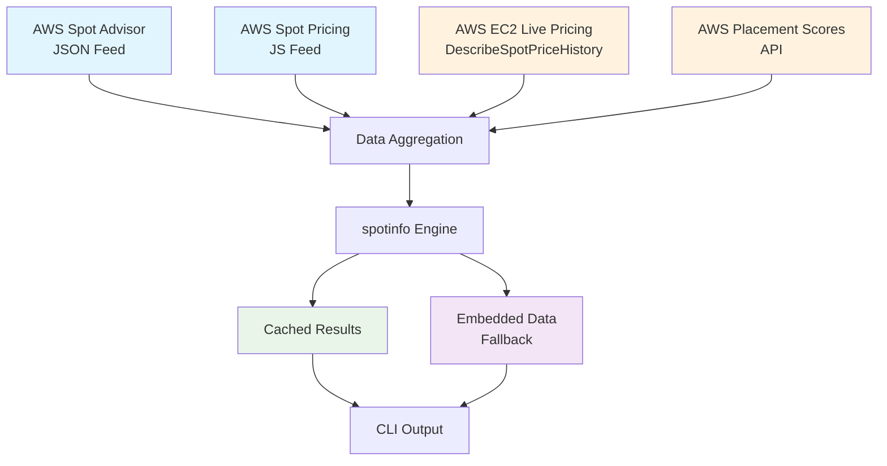

# Data Sources

## Overview

`spotinfo` combines multiple data sources to provide comprehensive AWS EC2 Spot Instance information, including pricing, interruption rates, and placement scores.

## Primary Data Sources

### 1. AWS Spot Instance Advisor Data
- **Source**: [AWS Spot Advisor JSON feed](https://spot-bid-advisor.s3.amazonaws.com/spot-advisor-data.json)
- **Maintained by**: AWS team
- **Update frequency**: Irregular — AWS republishes it every few months, so expect the
  savings and interruption figures to lag the market. The weekly `update-data` workflow
  warns if this feed has not changed in 180 days.
- **Contains**:
  - Instance specifications (vCPU, memory, EMR compatibility)
  - Interruption frequency ranges
  - Savings percentages compared to on-demand pricing
  - Regional availability data

### 2. AWS Spot Pricing Data
- **Source**: [AWS spot pricing feed](https://website.spot.ec2.aws.a2z.com/spot.json) — the
  feed behind <https://aws.amazon.com/ec2/spot/pricing/>
- **Maintained by**: AWS team
- **Update frequency**: Hourly
- **Format**: Plain JSON (no JSONP `callback(...)` wrapper)
- **Contains**:
  - Current spot prices by region and instance type
  - Operating system pricing variations (Linux/Windows)
- **Coverage**: 40 regions. Note that AWS omits all Middle East (`me-*`) regions from this
  feed; instances there report `$0` and fall through to the live pricing API below.
- **Caveat**: This is an undocumented endpoint, not a published AWS API. It can change
  without notice, which is why every fetch falls back to the embedded copy on failure.

> **Superseded source.** `http://spot-price.s3.amazonaws.com/spot.js` was the original JSONP
> feed. It has been frozen since **2024-05-13** and is missing every instance family released
> after that date, so it is no longer used.
>
> Mind the extension: the same host as the live feed also serves
> `website.spot.ec2.aws.a2z.com/spot.**js**`, which is a byte-identical copy of that dead
> object (same ETag). Only `spot.**json**` is live.

### 3. AWS EC2 Live Spot Pricing API
- **Source**: AWS `DescribeSpotPriceHistory` API
- **Access**: Real-time API calls (requires `ec2:DescribeSpotPriceHistory` permission)
- **Purpose**: Fills in pricing for instance types missing from the static feed — the newest
  families in the days before AWS adds them, plus every instance in the Middle East (`me-*`)
  regions, which AWS omits from the static feed entirely
- **Trigger**: Only called when instances have advisor data but $0 pricing from the static feed
- **Contains**:
  - Current spot prices per instance type and region
  - Prices from the last hour of trading
- **Behavior**:
  - Fetches prices in parallel across regions
  - Batches requests (up to 50 instance types per call)
  - Gracefully degrades — if unavailable, prices remain $0
  - Results marked with `live_price: true` in output

### 4. AWS Spot Placement Scores API
- **Source**: AWS `GetSpotPlacementScores` API
- **Access**: Real-time API calls (requires IAM permissions)
- **Contains**:
  - Regional placement scores (1-10 scale)
  - Availability zone-level placement scores
  - Likelihood of successful spot instance launch
  - Contextual scoring based on request composition

## Data Flow Architecture


```mermaid
graph TB
    A[AWS Spot Advisor<br/>JSON Feed] --> D[Data Aggregation]
    B[AWS Spot Pricing<br/>JS Feed] --> D
    B2[AWS EC2 Live Pricing<br/>DescribeSpotPriceHistory] --> D
    C[AWS Placement Scores<br/>API] --> D

    D --> E[spotinfo Engine]

    E --> F[Embedded Data<br/>Fallback]
    E --> G[Cached Results]

    G --> H[CLI Output]
    F --> H

    style A fill:#e1f5fe
    style B fill:#e1f5fe
    style B2 fill:#fff3e0
    style C fill:#fff3e0
    style F fill:#f3e5f5
    style G fill:#e8f5e8
```

## Network Resilience

### Embedded Data
- **Purpose**: Ensure functionality without network connectivity
- **Implementation**: Data is [embedded](https://golang.org/pkg/embed) into the binary during build
- **Coverage**: Complete spot advisor and pricing data snapshot
- **Update process**: Refreshed by the weekly `update-data` workflow, which opens a PR.
  Builds are hermetic — they embed exactly what is committed and never fetch.

### Fallback Strategy
1. **Primary**: Fetch fresh data from AWS feeds
2. **Secondary**: Use embedded data if network unavailable
3. **Live Pricing**: For instance types with $0 in the static feed, fetch current prices via EC2 `DescribeSpotPriceHistory` API (requires AWS credentials)
4. **Placement Scores**: No degradation — `--with-score` fails with an explicit error if AWS is unreachable. A synthesised score is indistinguishable from a real one, so none is produced.

## Data Processing Pipeline

### 1. Data Fetching
```go
// Pseudo-code flow
func fetchData() {
    advisorData := fetchFromURL("https://spot-bid-advisor.s3.amazonaws.com/spot-advisor-data.json")
    if advisorData == nil {
        advisorData = loadEmbeddedAdvisorData()
    }
    
    pricingData := fetchFromURL("https://website.spot.ec2.aws.a2z.com/spot.json")
    if pricingData == nil {
        pricingData = loadEmbeddedPricingData()
    }
}
```

### 2. Data Transformation
- **JSON parsing**: Convert AWS JSON format to internal structures
- **Price extraction**: Parse JavaScript callback format for pricing
- **Data normalization**: Standardize formats across sources
- **Validation**: Ensure data integrity and completeness

### 3. Data Enrichment
- **Instance type mapping**: Combine advisor and pricing data
- **Score integration**: Add placement scores when requested
- **Regional filtering**: Apply user-specified region constraints
- **Specification filtering**: Apply CPU, memory, and price filters

## Cache Strategy

### Placement Score Caching
- **Cache duration**: 10 minutes
- **Cache key format**: `region:az_flag:instance_types`
- **Purpose**: Reduce AWS API calls and improve performance
- **Implementation**: LRU cache with expiration

### Data Freshness Tracking
- **Timestamp tracking**: Record when data was last fetched
- **Freshness indicators**: Visual indicators for stale data (>30 minutes)
- **JSON metadata**: Include `score_fetched_at` timestamps in output

## Data Accuracy and Limitations

### Spot Advisor Data
- **Accuracy**: High - directly from AWS
- **Limitations**: 
  - Static snapshot updated periodically by AWS
  - May not reflect real-time market conditions
  - Regional variations in update frequency

### Spot Pricing Data
- **Accuracy**: High - current market prices
- **Limitations**:
  - Prices change frequently
  - Some regions may have delayed updates
  - Embedded data becomes stale over time

### Live Spot Pricing (EC2 API)
- **Accuracy**: Real-time from AWS API
- **Limitations**:
  - Requires `ec2:DescribeSpotPriceHistory` IAM permission
  - Only triggered for instance types missing from the static feed
  - Adds latency (parallel fetches with 10s timeout per region)
  - Prices marked with `live_price: true` in output to distinguish from static data

### Placement Scores
- **Accuracy**: Real-time from AWS API
- **Limitations**:
  - Requires proper IAM permissions
  - May be restricted by Service Control Policies
  - Contextual scoring can be confusing to users
  - API rate limits apply

## Data Update Process

### Refreshing the embedded data
Normally you do not do this by hand: the `update-data` GitHub Actions workflow runs weekly,
refreshes both feeds, and opens a PR. To do it manually:

```bash
make update-data    # Updates spot advisor data
make update-price   # Updates spot pricing data
make verify-data    # Parse gate on the embedded files
make build          # Embeds the committed data in the binary
```

`make build` does **not** download anything — it embeds whatever is on disk. Each update
target downloads to a `.tmp` file and only replaces the tracked file on success, so a failed
or truncated download cannot clobber good data.

### Runtime Data Flow
1. **Startup**: Load embedded data as baseline
2. **Network fetch**: Attempt to fetch fresh data from AWS feeds
3. **Merge**: Combine fresh data with embedded fallback
4. **API calls**: Fetch placement scores on demand (if enabled)
5. **Cache**: Store results for performance optimization

## Monitoring and Observability

### Data Source Health
- **Connection testing**: Verify AWS feed accessibility
- **Data validation**: Ensure JSON structure integrity
- **Fallback detection**: Log when embedded data is used

### Performance Metrics
- **Fetch duration**: Monitor AWS feed response times
- **Cache hit rate**: Track placement score cache effectiveness
- **API quota usage**: Monitor placement score API consumption

## Security Considerations

### API Access
- **IAM permissions**: `ec2:DescribeSpotPriceHistory` (live pricing), `ec2:GetSpotPlacementScores` (placement scores)
- **Credential management**: Uses AWS SDK default credential chain
- **Network security**: HTTPS for advisor data, HTTP for pricing (AWS provided)
- **Optional**: Both API features degrade gracefully without credentials

### Data Privacy
- **No personal data**: All data is public AWS pricing information
- **No data retention**: Only temporary caching for performance
- **No external transmission**: Data stays within AWS and local system

## Troubleshooting Data Issues

### Common Problems

**Stale pricing data:**
```bash
# Refresh the embedded feeds, verify, then rebuild
make update-data update-price verify-data build
```

**Missing placement scores:**
```bash
# Verify API permissions
aws ec2 get-spot-placement-scores --instance-types t3.micro --target-capacity 1 --region us-east-1
```

**Network connectivity issues:**
- Tool automatically falls back to embedded data
- Check network connectivity to `spot-bid-advisor.s3.amazonaws.com`
- Verify firewall settings for outbound HTTPS

**Permission errors:**
- Check IAM policy includes `ec2:GetSpotPlacementScores`
- Verify no Service Control Policy blocks the action
- Test with AWS CLI: `aws sts get-caller-identity`

## See Also

- [AWS Spot Placement Scores](aws-spot-placement-scores.md) - Detailed placement score documentation
- [Troubleshooting](troubleshooting.md) - Common issues and solutions
- [Usage Guide](usage.md) - Command reference and examples